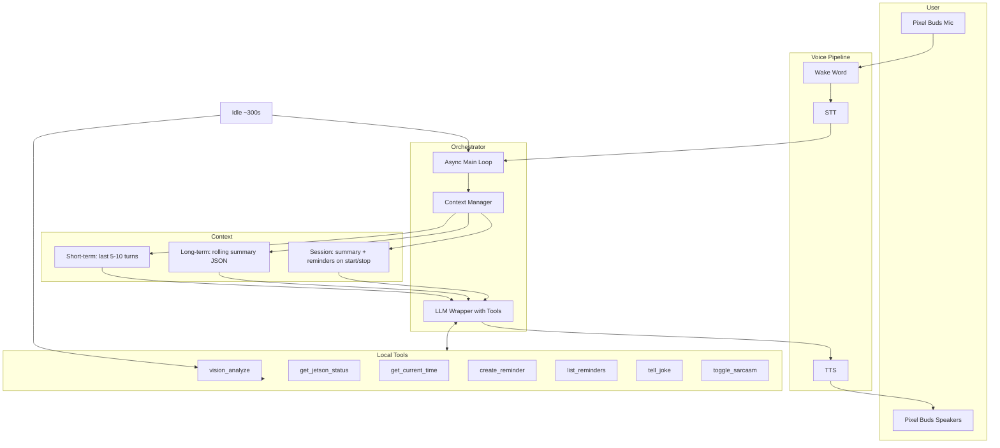

# Jarvis Agentic Orchestration Core – Plan

## 1. Architecture diagram

High-level flow with context and tools:




**Context flow (short + long-term):**

- **Short-term**: Last 5–10 conversation turns (user + assistant messages) passed to Ollama each request; managed in memory in the orchestrator.
- **Long-term**: Rolling summary (LLM-generated every 5–10 turns or on key events) stored in a JSON file on disk (e.g. `data/session_summary.json`); loaded on start and prepended to the system prompt or first user block when relevant.
- **Session persistence**: On start, load summary + reminders from `data/`; on stop (or periodically), save summary and reminders (reminders already in `data/reminders.json`).

---

## 2. Clarifications (optional)

- **Tool calling**: Prefer **Ollama native** `tools` + `tool_calls` (HTTP API) when the selected model supports it (e.g. qwen3, or newer llama/gemma with tools). Use **text-based fallback** (regex/parse for `Action: {"tool": "name", "args": {...}}` and `Final Answer:`) for models that do not return `tool_calls` (e.g. current llama3.2:1b).
- **LLM model**: Config currently uses `llama3.2:1b`. For better tool use you may switch to `llama3.2:3b` or `gemma2:2b`; plan keeps `config/settings.py` as single source of truth and does not assume a specific model.
- **YOLOE and “prompt”**: The current engine is built from **yoloe-26n-seg.pt** with **COCO-only** classes (80 classes) via `set_classes()` in [scripts/export_yolo_engine.sh](scripts/export_yolo_engine.sh). There is no open-vocab text prompt at inference in the current stack. **Plan**: `vision_analyze(prompt)` will (1) run the existing YOLOE engine on a fresh frame, (2) build a structured description (objects, counts, relations), (3) use optional `prompt` as a **filter/focus** (e.g. “person”, “cup”) and simple synonym mapping (“coffee mug” → “cup”) so the model can answer “what do you see?” and “do you see a person?”. Full open-vocab prompt-based YOLOE would require a different model/API and is out of scope for this phase.
- **Reminders**: `create_reminder(text, time)` will be implemented in tools and will **append** to the existing [utils/reminders.py](utils/reminders.py) format (add `save_reminders()` or equivalent and call from tool). Reminders already load from `data/reminders.json`; data dir is `data/` under project root.

### 2.5 Ollama configuration (local; use sudo to inspect and optimize)

Ollama runs **locally** on the Jetson. **Context size (num_ctx) and other limits can be set at the server level**, not only in Jarvis app config. The app sends `num_ctx` in the chat API `options`, but Ollama also uses environment variables and systemd overrides that can change defaults or caps.

- **Inspect current config (requires sudo for systemd and system paths)**:
  - Systemd overrides: `sudo cat /etc/systemd/system/ollama.service.d/*.conf` (existing [scripts/configure-ollama-systemd.sh](scripts/configure-ollama-systemd.sh) writes `gpu.conf` with `OLLAMA_NUM_GPU=1` and `LimitMEMLOCK=infinity`).
  - Effective environment: `sudo systemctl show ollama --property=Environment` (when run as systemd service).
  - User/data paths: `~/.ollama` (models); `/etc/ollama` or `/var/log/ollama` if present (install-dependent).
- **Optimize for 8GB Jetson**:
  - Set or verify **OLLAMA_NUM_GPU=1** in the service override (already in `gpu.conf`).
  - Optionally set **OLLAMA_NUM_CTX** in the same override (e.g. `Environment="OLLAMA_NUM_CTX=1024"`) so the server default matches Jarvis; app-side `OLLAMA_NUM_CTX` in [config/settings.py](config/settings.py) and in API requests should not exceed this. If the server sets a lower cap, the app’s request `num_ctx` may be clamped.
  - **OLLAMA_KEEP_ALIVE**: e.g. `-1` to keep model loaded (avoids reload latency) or a short value to free GPU when idle; tune for RAM vs responsiveness.
  - **OLLAMA_NUM_PARALLEL**: keep at 1 on Jetson to avoid OOM.
- **Plan**: Add a script or doc (e.g. `scripts/inspect-ollama-config.sh` or README/VERIFICATION section) that documents the exact **sudo** commands to read effective Ollama config and how to add `OLLAMA_NUM_CTX` (and related vars) to the systemd override; then `sudo systemctl daemon-reload && sudo systemctl restart ollama`. The orchestrator and [llm/ollama_client.py](llm/ollama_client.py) will continue to send `num_ctx` in API options; keep it consistent with server-side limits.

---

## 3. New and modified files


| File                                                 | Purpose                                                                                                                                                                  |
| ---------------------------------------------------- | ------------------------------------------------------------------------------------------------------------------------------------------------------------------------ |
| **orchestrator.py** (new)                            | Async main loop: wake → STT → parse/tool decision → LLM (with context) ↔ tools → TTS; proactive idle timer; retry logic.                                                 |
| **tools.py** (new)                                   | All 7 tools as Python functions; vision_analyze uses [vision/detector_yolo.py](vision/detector_yolo.py) + [vision/scene.py](vision/scene.py) and optional prompt filter. |
| **memory.py** (new)                                  | Long-term: load/save rolling summary (JSON), trigger summarization every 5–10 turns; session load/save (summary + reminders path).                                       |
| **llm/ollama_client.py**                             | Extend to support `tools` in request and `tool_calls` in response (and optional `thinking`); keep existing `chat()` for backward compatibility.                          |
| **llm/context.py**                                   | Extend to build messages with short-term history (last N turns) + long-term summary in system or first user message.                                                     |
| **config/prompts.py**                                | Add **JARVIS_ORCHESTRATOR_SYSTEM_PROMPT**: J.A.R.V.I.S. personality, tool list and format (Thought / Action / Final Answer), proactive behaviour.                        |
| **config/settings.py**                               | Add: `CONTEXT_MAX_TURNS`, `SUMMARY_EVERY_N_TURNS`, `PROACTIVE_IDLE_SEC`, `DATA_DIR`, `SUMMARY_PATH`, tool call limits.                                                   |
| **utils/reminders.py**                               | Add `save_reminders(base_dir, reminders)` and `add_reminder(base_dir, text, time)` for create_reminder tool.                                                             |
| **main.py**                                          | Add `--orchestrator` (or similar) to run the new async loop via orchestrator instead of the current E2E path; keep existing `--e2e` and `--one-shot` for compatibility.  |
| **scripts/inspect-ollama-config.sh** (new, optional) | Script (run with sudo where needed) to print effective Ollama env (systemd), override files, and suggest OLLAMA_NUM_CTX / KEEP_ALIVE for 8GB Jetson; document in README. |


---

## 4. Key implementation details

### 4.1 Tool schema (Ollama-compatible)

JSON schema for each tool, e.g.:

- **vision_analyze**: `{ "type": "function", "function": { "name": "vision_analyze", "description": "Run vision on current camera frame; optional prompt to focus (e.g. person, cup). Returns objects, counts, brief description.", "parameters": { "type": "object", "properties": { "prompt": { "type": "string", "description": "Optional focus, e.g. 'person', 'coffee mug'." } } } } }`
- **get_jetson_status**, **get_current_time**, **create_reminder**, **list_reminders**, **tell_joke**, **toggle_sarcasm**: same pattern (name, description, parameters).

Define these in `tools.py` as a list of dicts (and optionally a small parser from docstrings for text fallback). Limit to **2–3 tool calls per turn** in the orchestrator (cap after 2–3 tool rounds).

### 4.2 Orchestrator loop (pseudocode)

```text
async def run_orchestrator():
    memory = load_session(data_dir)  # summary + reminders path
    short_term = []   # list of {role, content} or {role, tool_calls, ...}
    idle_since = time.monotonic()
    proactive_task = asyncio.create_task(asyncio.sleep(300))

    while True:
        # 1) Proactive: every ~300s run vision with "person looking tired" etc.
        if idle and (time.monotonic() - idle_since) >= 300:
            obs = await run_tool("vision_analyze", {"prompt": "person"})
            if "person" in obs and should_suggest_break(obs):  # simple heuristic or small LLM call
                say("Sir, you appear fatigued — break suggested?")
            idle_since = time.monotonic()

        # 2) Wake → STT (existing wake loop + record + transcribe)
        query = await wait_for_wake_and_stt()   # block until wake + STT returns text
        if not query: continue

        # 3) Build messages: system (with long-term summary) + short_term (last 5–10) + user query
        system = build_system_with_summary(memory.summary)
        messages = build_messages_with_history(system, short_term, query, ...)

        # 4) ReAct loop (max 2–3 tool rounds)
        for _ in range(3):
            response = ollama_chat_with_tools(messages, tools_schema)
            append_to_short_term(short_term, response)
            if response.tool_calls:
                for tc in response.tool_calls[:2]:   # limit
                    result = await run_tool(tc.name, tc.arguments)
                    messages.append(tool_result_message(tc, result))
            else:
                final_answer = response.content
                break
        else:
            final_answer = response.content or "I'm unable to complete that, Sir."

        # 5) TTS and play
        await say(final_answer)
        append_to_short_term(short_term, user=query, assistant=final_answer)
        maybe_summarize(memory, short_term)   # every 5–10 turns
        save_session(memory)
        idle_since = time.monotonic()
```

Wake/STT today are synchronous (e.g. `run_wake_loop` callback). Options: (1) run them in a thread and expose a `asyncio.Future` or queue so the async loop can `await` the next query, or (2) run the orchestrator loop in a thread and keep wake/STT on main thread with a shared queue. Recommended: **single asyncio loop** with `run_in_executor` for STT/LLM/TTS and a queue from wake callback into the loop.

### 4.3 Enhanced system prompt (sketch)

Add to [config/prompts.py](config/prompts.py) something like:

- “You are J.A.R.V.I.S., Tony Stark’s witty, efficient, British-accented AI. Address the user as ‘Sir’ or ‘Steffen’. Be calm, dryly humorous, slightly sarcastic when fitting. Use concise, helpful replies. Think step-by-step. When you need information or actions, use the provided tools (vision_analyze, get_jetson_status, get_current_time, create_reminder, list_reminders, tell_joke, toggle_sarcasm). You may call tools in JSON format; then use the observations to give your final answer. Be proactive when context or vision suggests it (e.g. fatigue → suggest a break).”
- If using **text fallback**: “Output format: Thought: ... Action: {tool: name, args: {...}} or Final Answer: ...”

### 4.4 YOLOE integration in `vision_analyze`

- Reuse [vision/detector_yolo.py](vision/detector_yolo.py): `load_yolo_engine(settings.YOLOE_ENGINE_PATH)`, `run_inference(model, frame)`, `get_class_names(model)`.
- Reuse [vision/scene.py](vision/scene.py): `describe_scene(yolo_detections, face_count, class_names)` for the base description.
- **New**: One-shot capture from [vision/camera.py](vision/camera.py) (open, read one frame, release or keep for next call to avoid repeated open/close).
- **Prompt handling**: Optional `prompt: str` → normalize (e.g. “coffee mug” → “cup”), filter or emphasize in the description only classes that match; return a short structured string (e.g. “Objects: person(1), cup(2). Face count: 1. Note: person detected.”). No change to the engine itself; engine stays COCO 80-class.

### 4.5 create_reminder and list_reminders

- **utils/reminders.py**: Add `save_reminders(base_dir: Path, reminders: list[dict])` (write `reminders.json`); add `add_reminder(base_dir, text, time)` that loads, appends `{ "text": text, "time": time, "done": False }`, saves. Use `data_dir = Path(settings.DATA_DIR)` from config.
- **tools.py**: `create_reminder(text, time)` calls `add_reminder`; `list_reminders()` calls `load_reminders` and returns formatted string (reuse `format_reminders_for_llm` or similar).

### 4.6 get_jetson_status and get_current_time

- **get_jetson_status**: Call [utils/power.py](utils/power.py) `get_system_stats()` and optionally `get_power_mode()`; if `jtop` is available (jetson-stats), use it for GPU/mem/temp; otherwise tegrastats. Return a single string for LLM.
- **get_current_time**: `datetime.now().strftime(...)`; return formatted time/date string.

### 4.7 tell_joke and toggle_sarcasm

- **tell_joke**: Small list of dry/witty one-liners (or a single LLM call “tell one short joke”) returning a string.
- **toggle_sarcasm**: Set a global or orchestrator-held flag (e.g. `config.settings.SARCASM_ENABLED` or orchestrator state); return confirmation string. TTS will use the same flag for personality.

### 4.8 Error resilience

- **STT/LLM retry**: On failure, retry up to 2 times; on final failure, say “Brief glitch, Sir — retrying.” or “I couldn’t process that; please try again.”
- **Thermal**: Call `get_jetson_status` or `get_thermal_warning`; if thermal warning, inject into context or say a short alert (“System is running warm, Sir.”).
- **Tool errors**: Catch exceptions in each tool; return a short error string to the LLM (e.g. “Vision temporarily unavailable”) so the model can respond appropriately.

### 4.9 Performance (Orin Nano Super 8GB)

- Keep total tool execution **&lt;2s** per turn: vision one frame, status/tegrastats with short timeout, reminders file I/O is negligible.
- **Async**: Run STT/LLM/TTS in executor or non-blocking where possible; vision_analyze can run in executor to avoid blocking the loop.
- **Idle**: Low-power listening (existing wake word); proactive vision only every ~300s to limit GPU use.

---

## 5. Challenges and mitigations


| Challenge                     | Mitigation                                                                                                                                                       |
| ----------------------------- | ---------------------------------------------------------------------------------------------------------------------------------------------------------------- |
| **Token/context limits**      | `num_ctx` may be set server-side (Ollama env/systemd); **use sudo to inspect and align** app config; keep short-term to 5–10 turns; summary one short paragraph. |
| **Async + sync wake/STT**     | Wrap wake in a producer (queue or future); orchestrator consumes in async loop; STT/LLM in `run_in_executor` if needed.                                          |
| **BT latency**                | No code change; document that HFP latency is hardware-dependent; keep responses concise for TTS.                                                                 |
| **8GB memory**                | One LLM + one YOLOE engine; load engine once and reuse in vision_analyze; limit tool calls per turn; OOM fallback already in ollama_client.                      |
| **Models without tool_calls** | Text-based fallback: instruct model to output Action: JSON and Final Answer:; parse in orchestrator and call tools manually.                                     |
| **YOLOE “prompt”**            | Use as filter/focus on COCO classes + synonym map; no engine change this phase.                                                                                  |


---

## 6. Implementation order (step-by-step)

1. **Ollama config (sudo)**: Add `scripts/inspect-ollama-config.sh` (or README/VERIFICATION section) to inspect effective Ollama env (`sudo systemctl show ollama --property=Environment`), list `/etc/systemd/system/ollama.service.d/*.conf`, and document adding `OLLAMA_NUM_CTX` / `OLLAMA_KEEP_ALIVE` to overrides for 8GB Jetson; ensure [scripts/configure-ollama-systemd.sh](scripts/configure-ollama-systemd.sh) can optionally append these.
2. **Config**: Add `DATA_DIR`, `SUMMARY_PATH`, `CONTEXT_MAX_TURNS`, `SUMMARY_EVERY_N_TURNS`, `PROACTIVE_IDLE_SEC`, `MAX_TOOL_CALLS_PER_TURN` to [config/settings.py](config/settings.py).
3. **Reminders**: Add `save_reminders()` and `add_reminder()` in [utils/reminders.py](utils/reminders.py); unit tests for add/save.
4. **Memory**: Add [memory.py](memory.py) with load/save summary (JSON), load/save session (summary + reminders path), and `maybe_summarize(short_term)` that calls Ollama to summarize last N turns and updates rolling summary.
5. **Tools**: Add [tools.py](tools.py) with all 7 functions and the list of Ollama tool schemas; vision_analyze using camera + detector_yolo + scene + optional prompt filter; get_jetson_status (power + tegrastats/jtop); get_current_time; create_reminder/list_reminders; tell_joke; toggle_sarcasm (state in config or orchestrator).
6. **LLM client**: In [llm/ollama_client.py](llm/ollama_client.py), add `chat_with_tools(base_url, model, messages, tools, num_ctx)` that sends `tools` in the payload and returns `content` + `tool_calls`; handle `message.tool_calls` in response. Keep existing `chat()` unchanged.
7. **Context**: In [llm/context.py](llm/context.py), add `build_messages_with_history(system, long_summary, short_term_turns, current_user_message, ...)` that prepends long summary to system or first user message and builds last N turns as messages.
8. **Prompts**: In [config/prompts.py](config/prompts.py), add `JARVIS_ORCHESTRATOR_SYSTEM_PROMPT` with personality and tool descriptions; optional text-based format for non–tool-calling models.
9. **Orchestrator**: Add [orchestrator.py](orchestrator.py): async loop (wake → STT → context build → ReAct tool loop → TTS); queue or future for wake+STT; proactive task every PROACTIVE_IDLE_SEC; retry STT/LLM 2x; call memory load/save and maybe_summarize; cap tool calls per turn.
10. **main.py**: Add flag (e.g. `--orchestrator`) that runs `orchestrator.run_orchestrator()` instead of `_handle_e2e`; ensure data dir exists and session loads on start.
11. **Tests**: Unit tests for tools (vision_analyze with mock frame, get_current_time, create_reminder/list_reminders, tell_joke, toggle_sarcasm); unit test for memory load/save/summarize; E2E test for orchestrator with `--no-vision` and/or mock tools if needed.
12. **Docs**: Update README/VERIFICATION with orchestrator usage and tool list; note YOLOE prompt as filter-only for this phase.

---

## 7. Summary

- **New**: `orchestrator.py`, `tools.py`, `memory.py`; extended `llm/ollama_client.py`, `llm/context.py`, `config/prompts.py`, `config/settings.py`, `utils/reminders.py`; `main.py` entrypoint for orchestrator.
- **YOLOE**: Reuse existing engine and scene description; `vision_analyze(prompt)` uses prompt as optional filter/focus on COCO classes with simple synonym mapping; no engine or export change.
- **Tool calling**: Prefer Ollama native `tools`/`tool_calls`; implement text-based fallback for models that don’t support it.
- **Context**: Short-term in-memory (5–10 turns), long-term rolling summary in JSON; session persistence on start/stop.

No code or file changes will be made until you approve this plan. If you want to fix choices (e.g. tool-calling style, default LLM model, or YOLOE prompt behaviour), say so and the plan can be adjusted.