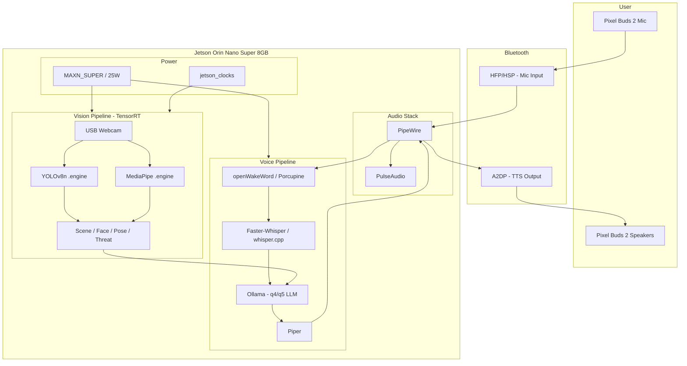

# Jarvis – Offline Voice Assistant on Jetson Orin Nano Super (JetPack 6.2)

## System snapshot (from your device)

- **L4T**: R36.4.7 (JetPack 6.2), kernel 5.15.148-tegra, aarch64
- **Device**: NVIDIA Jetson Orin Nano Engineering Reference Developer Kit Super
- **RAM**: 7.4 Gi total, ~3.5 Gi available; target &lt;7.5 Gi to avoid swap on microSD
- **GPU**: Orin (nvgpu), CUDA 12.6, Driver 540.4.0
- **Power**: Already **MAXN_SUPER** (nvpmodel mode 2); `nvpmodel` and `jetson_clocks` present
- **Python**: 3.10.12
- **Audio**: PipeWire 0.3.48 + PulseAudio 15.99 (Pulse is current default); BlueZ 5.64; BT controller present and powered
- **Not yet present**: Ollama, PyTorch, TensorRT Python bindings, USB camera (no `/dev/video*`), Wireplumber (optional; `wpctl` not in PATH)

---

## 1. Hardware-specific architecture diagram




- **Super boosts**: MAXN_SUPER (already set) gives full CPU/GPU clocks; run `sudo jetson_clocks` for max clocks and lock them. Use `jtop` or `tegrastats` to monitor thermals and power.
- **Bluetooth flow**: Pixel Buds 2 → BlueZ → PipeWire/Pulse → app. A2DP for TTS (high quality); HFP for mic (profile switch may be needed; fallback: USB mic).
- **TensorRT path**: USB cam → OpenCV/V4L2 → YOLOv8n/MediaPipe exported to `.engine` (Orin) → inference on GPU; descriptions fed into LLM context.

---

## 2. Exact tech stack and install/setup commands

### 2.1 Power mode (already MAXN_SUPER)

- Confirm: `nvpmodel -q` → MAXN_SUPER (mode 2).
- Lock max clocks (optional, for benchmarks): `sudo jetson_clocks`.
- Monitor: `jtop` (install if needed: `sudo pip3 install jetson-stats`) or `tegrastats`.

### 2.2 System packages (sudo)

```bash
# Bluetooth and audio (Wireplumber for better BT routing)
sudo apt update
sudo apt install -y wireplumber pipewire-audio pipewire-pulse bluez-tools pulseaudio-utils
# Optional: ofono for HFP if needed
# sudo apt install -y ofono
```

- Default sink/source for Pixel Buds: `pactl` or `wpctl` (after Wireplumber) to set default sink (A2DP) and default source (HFP or USB mic).

### 2.3 Python environment

- **Recommendation**: `venv` in project root (e.g. `/home/jarvis/Jarvis/venv`).
- Python 3.10.12 (system) is sufficient; use it for the venv.

```bash
cd /home/jarvis/Jarvis
python3 -m venv venv
source venv/bin/activate
pip install --upgrade pip
```

### 2.4 Ollama (local install – GPU)

- **Local Ollama only** (no Docker). Install via official script: `bash scripts/install-ollama.sh`.
- Start Ollama with GPU: `bash scripts/start-ollama.sh` (sets `OLLAMA_NUM_GPU=1`). API at `http://127.0.0.1:11434`.
- Pull a model: `ollama pull llama3.2:1b` or `ollama pull llama3.2:3b` (or `qwen2.5:1.5b`). Default in config: `llama3.2:1b`.
- For systemd: `sudo scripts/configure-ollama-systemd.sh` then `sudo systemctl enable --now ollama`. Before first GPU use: `sudo scripts/prepare-ollama-gpu.sh`.

### 2.5 TensorRT export for YOLO (Phase 3)

- Use Ultralytics with TensorRT export on the device (Orin):

```bash
pip install ultralytics
# From Python or CLI:
# yolo export model=yolov8n.pt format=engine device=0 half=True workspace=4
```

- Or use `trtexec` (from JetPack) if you have a serialized ONNX first: `yolo export model=yolov8n.pt format=onnx` then convert ONNX → engine for Orin.
- MediaPipe: use official MediaPipe Python + GPU delegate; TensorRT path for face/pose is optional (GPU delegate may be enough for 30 FPS).

### 2.6 PipeWire / Bluetooth pairing and HFP

- Ensure PipeWire is running and, if desired, set as default over Pulse: user session `pipewire` + `pipewire-pulse` (and Wireplumber).
- Pair Pixel Buds 2:

```bash
bluetoothctl
power on
scan on
# Find Pixel Buds 2, note MAC
pair <MAC>
trust <MAC>
connect <MAC>
```

- In code: use `pyaudio` or `sounddevice` and select device by name (e.g. “Pixel Buds 2” or “Buds”). Enumerate with `sounddevice.query_devices()`.
- HFP: if the buds don’t show as input, switch profile to HFP/HSP in `bluetoothctl` or via GUI (blueman). Fallback: USB microphone and use A2DP only for output.

### 2.7 Project dependencies (requirements.txt)

- Core: `ollama`, `piper-tts`, `faster-whisper` or `whisper-cpp` bindings, `openwakeword` or `pvporcupine`, `opencv-python`, `sounddevice`, `pyaudio`, `numpy`, `requests` (for Ollama HTTP).
- Vision: `ultralytics`, `mediapipe`, `torch` (if using PyTorch-based STT or vision; prefer Jetson-compatible wheel from NVIDIA if available).
- Optional: `pygame` or `tkinter` (usually with Python) for status GUI; `jetson-stats` for jtop in Python.

---

## 3. File/directory structure

```
Jarvis/
├── main.py                 # Entry: parse args, init modules, run main loop
├── config/
│   ├── __init__.py
│   ├── settings.py         # Paths, model names, RAM/thermal limits
│   └── prompts.py          # Jarvis system prompt and personality
├── audio/
│   ├── __init__.py
│   ├── input.py            # BT/USB mic selection, recording (sounddevice/pyaudio)
│   ├── output.py           # Piper TTS → default sink (A2DP)
│   └── bluetooth.py        # Device enumeration, default sink/source hints
├── voice/
│   ├── __init__.py
│   ├── wakeword.py         # openWakeWord or Porcupine "Jarvis" / "Hey Jarvis"
│   ├── stt.py              # Faster-Whisper or whisper.cpp
│   └── tts.py              # Piper (British male: en_GB-alan-medium or HF Jarvis-like)
├── llm/
│   ├── __init__.py
│   ├── ollama_client.py    # HTTP client to local Ollama (streaming optional)
│   └── context.py         # Build prompt with vision + reminders
├── vision/
│   ├── __init__.py
│   ├── camera.py           # OpenCV/V4L2 capture, configurable res/FPS
│   ├── detector_yolo.py    # YOLOv8n TensorRT .engine inference
│   ├── detector_mediapipe.py  # Face/pose/emotion (TensorRT or GPU delegate)
│   └── scene.py            # Describe scene/motion/threat for LLM
├── utils/
│   ├── __init__.py
│   ├── power.py            # nvpmodel -q, jetson_clocks, thermal check
│   ├── logging_config.py
│   └── reminders.py        # Local file-based reminders
├── requirements.txt
├── README.md               # Setup, pairing, power, run instructions
└── venv/                   # Python virtualenv
```

- Optional: `gui/` with a single module for status overlay + vision preview (Phase 5).

---

## 4. Phased development roadmap


| Phase       | Focus                                                 | Deliverables                                                                                                                                                                            |
| ----------- | ----------------------------------------------------- | --------------------------------------------------------------------------------------------------------------------------------------------------------------------------------------- |
| **Phase 1** | Hardware + power + Bluetooth + wake + voice loop test | Power script/docs; PipeWire/Wireplumber + BT pairing; `audio/` device selection and playback test; `voice/wakeword` triggers; minimal “listen → play WAV” loop (no LLM).                |
| **Phase 2** | LLM + TTS/STT                                         | Ollama pull (e.g. Qwen2.5 1.5B or SmolLM); `llm/ollama_client` + Jarvis prompt; `voice/stt` + `voice/tts`; full loop: wake → STT → Ollama → Piper → A2DP.                               |
| **Phase 3** | TensorRT vision + USB cam                             | YOLOv8n export to `.engine`; MediaPipe face/pose; `vision/camera` + `vision/detector_*` + `vision/scene`; configurable 720p/30 FPS; vision running in thread, no LLM fusion yet.        |
| **Phase 4** | Full Jarvis loop + proactivity + vision–LLM fusion    | Vision descriptions in LLM context; proactive lines (fatigue/posture, “coffee”); commands: time, reminders, jtop stats, jokes, sarcasm toggle; threading/asyncio for wake, vision, LLM. |
| **Phase 5** | Polish + GUI + sarcasm                                | Error handling (OOM → smaller model, thermal, BT fallback); simple status GUI (Pygame/Tkinter) with vision preview; personality tuning.                                                 |

### Implementation status (all phases complete)

- **Phase 1**: Power docs in README; `audio/` device selection, playback, BT hints; `voice/wakeword` (openWakeWord); `--voice-only` (wake → TTS "Hello Sir"); `--test-audio`.
- **Phase 2**: Ollama (local); `llm/ollama_client` + `config/prompts`; `voice/stt` (Faster-Whisper), `voice/tts` (Piper); full loop `--e2e` and `--one-shot`.
- **Phase 3**: `scripts/export_yolo_engine.sh`; `vision/camera`, `vision/detector_yolo`, `vision/detector_mediapipe`, `vision/scene`; 720p/30 in config; vision thread in E2E; E2E tests in `tests/e2e/test_vision_e2e.py`.
- **Phase 4**: Vision in LLM context; proactive prompt (posture/fatigue/coffee); time, reminders, system stats (tegrastats) in context; sarcasm toggle; threading (wake, vision, LLM) in `main.py`.
- **Phase 5**: OOM fallback to smaller model, thermal warning, default mic (BT/USB); `gui/overlay` (Tkinter) with optional vision preview (Pillow); personality in prompts. Validation: `ruff check`, `pytest tests/`, `python main.py --help`.

---

## 5. Potential challenges and mitigations

- **8 GB VRAM/RAM**: Run only quantized models (q4/q5); one vision model + one LLM at a time; cap Piper/Ollama concurrency. If OOM, switch to smaller Ollama model (e.g. 1.5B) and/or reduce vision resolution/batch.
- **Bluetooth HFP on JetPack 6.x**: HFP mic can be unreliable; implement USB mic as fallback; in code, prefer default source from `pactl`/`wpctl` and document profile switching (A2DP vs HFP) for Pixel Buds.
- **Real-time performance**: Profile with `jtop`; keep vision at 30 FPS with TensorRT; use threading so STT/LLM don’t block capture; consider lowering STT chunk size or using “small”/“medium” faster-whisper.
- **microSD I/O**: Avoid swap: enforce RAM budget &lt;7.5 GB; logs to tmpfs or minimal writes; model files on SD are acceptable (read-heavy).
- **USB cam compatibility**: Use OpenCV with index 0 or by name; support 720p/1080p and FPS in config; if a specific UVC device fails, document and add a “generic UVC” preset.

---

## 6. Estimated effort per phase

- **Phase 1**: 1–2 days (BT pairing, PipeWire, wake word, audio I/O and one “hello” loop).
- **Phase 2**: 2–3 days (Ollama + prompt, STT, Piper, full voice loop and basic commands).
- **Phase 3**: 2–3 days (YOLO TensorRT export, MediaPipe, camera thread, scene description).
- **Phase 4**: 2–3 days (context building, proactivity, commands, threading).
- **Phase 5**: 1–2 days (GUI, error handling, personality).

**Total (intermediate Python/ML)**: ~8–13 days.

---

## Next steps

- **Completed.** Ollama running with `llama3.2:1b`; default `OLLAMA_MODEL=llama3.2:1b` in config.
- Run: `python main.py --dry-run`, `python main.py --e2e --no-vision` (or `--e2e` with camera), `python main.py --one-shot`, `python main.py --gui --e2e` for overlay.
- Export YOLO: `bash scripts/export_yolo_engine.sh` (with venv active).
- Full validation: `ruff check .`, `pytest tests/`, `pytest tests/ -m e2e`.