<div align="center">

# K.A.R.E.N. — Your Personal J.A.R.V.I.S. on Jetson

**A fully offline, Iron Man-style voice + vision AI assistant running entirely on a $249 Jetson Orin Nano Super (8 GB). No cloud. No API keys. No subscriptions. Just you and your AI.**

[](LICENSE)
[](https://developer.nvidia.com/embedded/jetpack)
[](https://python.org)
[](https://ollama.com)
[](https://kit.svelte.dev)
[](tests/)
[](https://github.com/steffenpharai/karen)

*"At your service, sir."*

</div>

---

<!-- TODO: Replace with your recorded GIF/video -->
<!-- Record a 15-20s clip: wake word trigger → voice query → YOLOE detection overlay → hologram render → sarcastic JARVIS reply via Bluetooth earbuds. Upload to GitHub and uncomment: -->
<!-- <p align="center"></p> -->

<p align="center">
  <strong>
    <a href="#-quick-start">Quick Start</a> · <a href="#-features">Features</a> · <a href="#-performance">Performance</a> · <a href="#-architecture">Architecture</a> · <a href="#-roadmap">Roadmap</a> · <a href="#-community">Community</a>
  </strong>
</p>

---

## Why KAREN?

Most "local AI assistants" are a chatbot with a microphone. KAREN is what happens when you actually build the full Iron Man experience on a $249 board:

| What others do | What KAREN does |
|:---|:---|
| Text chat with local LLM | **Wake word → STT → LLM with tools → TTS** through Bluetooth earbuds |
| Maybe a webcam feed | **TensorRT YOLOE open-vocab detection** + ByteTrack tracking + **3D holograms** |
| "Works on my 4090" | **Runs on 8 GB shared RAM** — LLM + vision + depth + vitals simultaneously |
| Cloud fallback "for now" | **Zero cloud dependencies.** Everything local. Always. |
| Basic web UI | **SvelteKit PWA** with live camera, Three.js holograms, vitals, Iron Man HUD, threat alerts |
| No health awareness | **rPPG heart rate**, fatigue detection, posture scoring, proactive health alerts |
| Crashes on OOM | **Multi-layer CUDA OOM recovery** with automatic context reduction and model reload |

---

## ✨ Features

### Voice Pipeline
- **openWakeWord** — custom wake word, always listening
- **Faster-Whisper** — local STT, no cloud transcription
- **Piper TTS** — British male voice (Paul Bettany energy)
- **Bluetooth** — full HFP/A2DP support for wireless earbuds

### LLM Brain
- **Qwen3:1.7b** (Q4_K_M) via Ollama — native tool-calling, 100% GPU offload
- **8192-token context** — sweet spot for 8 GB: fast inference, no swap pressure
- **Intent-based routing** — only sends tool schemas when needed (0.5s greetings, not 8s)
- **Adaptive thinking** — `think=false` for chat, `think=true` for tool calls
- **JARVIS persona** — formal British wit, sarcasm toggle, MCU-accurate responses

### Vision Suite
- **YOLOE-26N** (TensorRT FP16) — open-vocabulary detection, set any prompt at runtime
- **ByteTrack** — multi-object tracking with velocity estimation
- **DepthAnything V2 Small** (TensorRT FP16) — real-time depth maps for 3D holograms
- **MediaPipe** — face mesh (EAR fatigue, rPPG heart rate) + pose (posture scoring)
- **Threat detection** — anomaly scoring with LLM-integrated alerts
- **Portable mode** — 320×320 @ 10 FPS with thermal throttling for walk-around use

### Iron Man PWA
- **Live MJPEG** camera feed with detection overlays and threat-level borders
- **Three.js holograms** — real-time 3D point cloud visualization (2D Canvas fallback)
- **HUD overlay** — Iron Man-style AR tracking with real-time annotations
- **Vitals dashboard** — fatigue, posture, heart rate, all via WebSocket
- **Jetson stats** — GPU/CPU/thermal monitoring
- **Reminders** — create and manage via voice or UI
- **Accessible from any device** on the LAN

### Robustness
- **247 unit + E2E tests** with pytest
- **Multi-layer CUDA OOM protection** — auto context reduction (8192→4096→2048→1024)
- **Camera auto-reconnect** on USB disconnect
- **Graceful degradation** — every subsystem is optional, pipeline continues if one fails

---

## ⚡ Performance

Real benchmarks on Jetson Orin Nano Super (8 GB), MAXN_SUPER, `jetson_clocks`:

| Scenario | Latency | Notes |
|:---|:---|:---|
| Greeting / status / time | **0.5 – 0.7s** | `think=false`, no tools — instant |
| Tool call (joke, reminder) | **3.6 – 8.4s** | `think=true`, selected tools only |
| Vision query (pre-fetched) | **0.7s** | Scene already in context |
| Full voice loop (wake → reply) | **< 4s** | STT + LLM + TTS for simple queries |

<details>
<summary><strong>Context size benchmarks</strong></summary>

| num_ctx | VRAM | GPU% | Chat Latency | Verdict |
|:---|:---|:---|:---|:---|
| 2048 | 1.6 GB | 100% | 12.9s | KV thrashing — unusable |
| 4096 | 1.7 GB | 100% | 4.1s | Acceptable |
| **8192** | **2.0 GB** | **100%** | **3.5s** | **Production pick** |
| 12288 | 2.3 GB | 100% | ~4s | Swap pressure |
| 16384 | 2.6 GB | 30/70 | Slow | Spills to CPU — no go |

</details>

<details>
<summary><strong>Memory budget breakdown</strong></summary>

| Component | RAM | Notes |
|:---|:---|:---|
| Qwen3:1.7b @ 8192 ctx | ~2.0 GB | 100% GPU, flash attention + q8_0 KV |
| YOLOE-26N TensorRT | ~0.3 GB | FP16 engine |
| DepthAnything V2 Small | ~0.4 GB | FP16 engine, optional |
| MediaPipe (face + pose) | ~0.1 GB | CPU inference |
| Faster-Whisper small | ~0.5 GB | Loaded on demand |
| OS + Desktop + Python | ~3.5 GB | JetPack 6.x + X11 |
| **Total** | **~6.8 GB** | Fits in 7.6 GB with headroom |

</details>

---

## 🚀 Quick Start

### Prerequisites

- **Jetson Orin Nano Super** (8 GB) with JetPack 6.x
- USB webcam + Bluetooth earbuds (or USB mic + speakers)
- Ollama installed ([one-line install](https://ollama.com/install.sh))

### One-command setup

```bash
# Clone and enter
git clone https://github.com/steffenpharai/karen.git && cd karen

# Setup Python environment
python3 -m venv venv && source venv/bin/activate
pip install --upgrade pip && pip install -r requirements.txt

# Download all models (wake word, STT, TTS voice)
bash scripts/bootstrap_models.sh

# Pull the LLM
ollama pull qwen3:1.7b

# Configure Ollama for 8GB Jetson (flash attention, 8-bit KV cache, etc.)
sudo bash scripts/configure-ollama-systemd.sh
sudo systemctl daemon-reload && sudo systemctl restart ollama

# Build the PWA frontend
cd pwa && npm install && npm run build && cd ..

# Launch! (full-stack: voice + vision + PWA + Iron Man HUD)
python main.py --serve
```

Open `http://<jetson-ip>:8000` from any device on your network. That's it.

<details>
<summary><strong>Optional: TensorRT engines for vision</strong></summary>

```bash
source venv/bin/activate && . /etc/profile.d/cuda.sh

# YOLOE-26N detection engine (required for vision)
bash scripts/export_yolo_engine.sh

# DepthAnything V2 depth engine (required for 3D holograms)
bash scripts/export_depth_engine.sh
```

Engine builds run on-device and take several minutes. Once built, they're cached in `models/`.

</details>

<details>
<summary><strong>Optional: CUDA + PyTorch for Jetson</strong></summary>

```bash
# System dependencies
sudo apt-get install -y python3-pip libopenblas-dev

# cuSPARSELt (required for PyTorch 24.06+ on JetPack 6.x)
bash scripts/install-cusparselt.sh

# CUDA in PATH
sudo bash scripts/install-cuda-path.sh

# PyTorch with CUDA (Jetson wheel)
source venv/bin/activate && . /etc/profile.d/cuda.sh
bash scripts/install-pytorch-cuda-nvidia.sh

# Verify
python -c "import torch; print('CUDA:', torch.cuda.is_available())"
```

</details>

---

## 🔧 Usage

```bash
source venv/bin/activate

python main.py --serve              # Full-stack: API + PWA + voice + vision
python main.py --serve --portable   # Walk-around mode: 320x320, 10 FPS, thermal-aware
python main.py --orchestrator       # Voice-only agentic loop (no web UI)
python main.py --e2e                # Voice loop without tools
python main.py --one-shot "Hello"   # Single text query (no mic needed)
python main.py --dry-run            # Validate config
python main.py --test-audio         # List audio devices
python main.py --yolo-visualize     # Live camera + YOLOE detections (OpenCV window)
```

### Tools available to the LLM

| Tool | What it does |
|:---|:---|
| `vision_analyze` | Re-scan camera with optional open-vocabulary prompt |
| `hologram_render` | Generate 3D hologram and push to all connected PWA clients |
| `create_reminder` | Save a reminder with optional time |
| `tell_joke` | Deliver a J.A.R.V.I.S.-quality one-liner |
| `toggle_sarcasm` | Toggle sarcasm mode (you've been warned) |

Time, system stats, scene description, vitals, threat level, and reminders are injected directly into context — no tool call overhead for those.

---

## 🏗️ Architecture

```mermaid
graph TB
    subgraph VOICE["🎙️ Voice Pipeline"]
        WW[openWakeWord] --> STT[Faster-Whisper STT]
        STT --> ORCH
        TTS[Piper TTS<br/>British Male] --> BT[Bluetooth<br/>HFP/A2DP]
    end

    subgraph BRAIN["🧠 LLM Brain"]
        ORCH[Orchestrator<br/>Intent Router] --> LLM[Qwen3:1.7b<br/>Ollama · 100% GPU]
        LLM --> TOOLS[Tool Executor]
        TOOLS --> ORCH
        MEM[Short/Long-term<br/>Memory] --> ORCH
    end

    subgraph VISION["👁️ Vision Suite"]
        CAM[USB Camera] --> YOLO[YOLOE-26N<br/>TensorRT]
        YOLO --> TRACK[ByteTrack<br/>Tracking]
        CAM --> DEPTH[DepthAnything V2<br/>TensorRT]
        CAM --> MP[MediaPipe<br/>Face + Pose]
        TRACK --> THREAT[Threat<br/>Scorer]
        MP --> VITALS[Vitals<br/>EAR · Posture · rPPG]
    end

    subgraph SERVER["🌐 Server"]
        API[FastAPI] --> WS[WebSocket<br/>Bridge]
        API --> MJPEG[MJPEG<br/>Stream]
        API --> REST[REST API]
    end

    subgraph PWA["📱 SvelteKit PWA"]
        CHAT[Chat Panel]
        HOLO[Three.js<br/>Hologram]
        HUD[Iron Man<br/>HUD Overlay]
        VIT[Vitals Panel]
        DASH[Jetson Stats]
    end

    ORCH --> TTS
    VISION --> WS
    VISION --> ORCH
    WS --> PWA
    LLM --> API

    style VOICE fill:#1a1a2e,stroke:#e94560,color:#fff
    style BRAIN fill:#1a1a2e,stroke:#0f3460,color:#fff
    style VISION fill:#1a1a2e,stroke:#16213e,color:#fff
    style SERVER fill:#1a1a2e,stroke:#533483,color:#fff
    style PWA fill:#1a1a2e,stroke:#e94560,color:#fff
```



<details>
<summary><strong>Vision pipeline detail</strong></summary>

```
Camera Frame
  ├─ YOLOE-26N (TensorRT) → detections + open-vocab prompting
  ├─ ByteTrack → multi-object tracking + velocity estimation
  ├─ MediaPipe Face Mesh → EAR fatigue detection, rPPG heart rate
  ├─ MediaPipe Pose → posture scoring
  ├─ DepthAnything V2 Small → depth map + 3D point cloud
  └─ ThreatScorer → threat assessment (low/medium/high/critical)
       ↓
  WebSocket broadcast → PWA (hologram, vitals, threat panels)
       ↓
  Injected into LLM context → proactive alerts
```

</details>

---

## 🗂️ Project Structure

```
main.py                  CLI dispatcher and entry point
orchestrator.py          Async agentic loop (context, tools, proactive vision)
tools.py                 Tool registry (vision, hologram, reminders, joke, sarcasm)
memory.py                Session summary and persistence

config/
  settings.py            Jetson/Ollama tuning parameters
  prompts.py             JARVIS persona and system prompts

audio/                   Mic selection, recording, playback, Bluetooth hints
voice/                   Wake word (openWakeWord), STT (Faster-Whisper), TTS (Piper)
llm/                     Ollama client (OOM-hardened) and context builder

vision/
  camera.py              USB camera with auto-reconnect + portable mode
  detector_yolo.py       YOLOE-26N TensorRT (open-vocab via set_classes)
  tracker.py             ByteTrack multi-object tracking with velocity
  depth.py               DepthAnything V2 Small TensorRT (depth + point clouds)
  vitals.py              Fatigue (EAR), posture scoring, rPPG heart rate
  threat.py              Threat/anomaly scoring
  scene.py               Natural-language scene description for LLM context
  shared.py              Pipeline orchestration and singletons

server/
  app.py                 FastAPI: REST, MJPEG, vision broadcast loop
  bridge.py              WebSocket bridge (hologram, vitals, threat broadcasts)

pwa/                     SvelteKit PWA frontend
  ChatPanel              Voice/text interaction
  CameraStream           Live MJPEG with detection overlays
  HologramView           Three.js 3D / 2D Canvas fallback
  VitalsPanel            Real-time fatigue, posture, heart rate
  HUD Overlay            Iron Man-style AR annotations
  Dashboard              Jetson GPU/CPU/thermal stats

scripts/                 Setup, export, and bootstrap scripts
tests/                   247 unit + E2E tests (pytest)
models/                  TTS voices, TensorRT engines
```

---

## 🔩 Hardware

### Required

| Component | Recommendation | Notes |
|:---|:---|:---|
| **Compute** | [Jetson Orin Nano Super 8GB](https://developer.nvidia.com/embedded/learn/get-started-jetson-orin-nano-devkit) | $249, 67 TOPS, shared 8GB LPDDR5 |
| **Storage** | 128GB+ NVMe SSD or high-speed microSD | SSD strongly recommended for swap |
| **Camera** | Any USB UVC webcam | Logitech C920/C922 work great |

### Recommended

| Component | Why |
|:---|:---|
| Bluetooth earbuds (e.g. Pixel Buds) | Wireless voice I/O via HFP/A2DP |
| USB microphone | More reliable than BT for mic input |
| Active cooling / fan | Sustained vision workloads generate heat |
| NVMe SSD (512GB) | Faster model loading, better swap |

### Power Mode

```bash
sudo nvpmodel -q          # Should show MAXN_SUPER
sudo jetson_clocks         # Lock max CPU/GPU/EMC clocks
jtop                       # Monitor (install: sudo pip3 install jetson-stats)
```

---

## ⚙️ Configuration

All settings are environment variables with sane defaults. Key ones:

| Variable | Default | Description |
|:---|:---|:---|
| `OLLAMA_MODEL` | `qwen3:1.7b` | LLM model |
| `OLLAMA_NUM_CTX` | `8192` | Context window (sweet spot for 8GB) |
| `OLLAMA_NUM_PREDICT` | `512` | Max output tokens |
| `JARVIS_DEPTH_ENABLED` | `0` | Enable 3D depth / holograms |
| `JARVIS_PORTABLE` | `0` | Portable mode (lower res, thermal-aware) |
| `JARVIS_SERVE_PORT` | `8000` | Server port |
| `JARVIS_VISION_BROADCAST_SEC` | `5` | Vision broadcast interval |

<details>
<summary><strong>Full environment variable reference</strong></summary>

| Variable | Default | Description |
|:---|:---|:---|
| `OLLAMA_BASE_URL` | `http://127.0.0.1:11434` | Ollama API endpoint |
| `OLLAMA_MODEL` | `qwen3:1.7b` | Default LLM model |
| `OLLAMA_NUM_CTX` | `8192` | Context window size |
| `OLLAMA_NUM_CTX_MAX` | `8192` | Hard cap for context |
| `OLLAMA_NUM_PREDICT` | `512` | Max output tokens (includes thinking tokens) |
| `OLLAMA_THINK` | `0` | Global think flag |
| `OLLAMA_TEMPERATURE` | `0.6` | Sampling temperature |
| `JARVIS_CAMERA_INDEX` | `0` | Camera device index |
| `JARVIS_CAMERA_DEVICE` | *(none)* | Force camera device path |
| `JARVIS_TTS_VOICE` | `models/voices/en_GB-alan-medium.onnx` | Piper voice model path |
| `JARVIS_SERVE_HOST` | `0.0.0.0` | Server bind address |
| `JARVIS_SERVE_PORT` | `8000` | Server port |
| `JARVIS_CONTEXT_MAX_TURNS` | `4` | Max history turns |
| `JARVIS_DEPTH_ENABLED` | `0` | Enable DepthAnything depth |
| `JARVIS_PORTABLE` | `0` | Enable portable mode |
| `JARVIS_PORTABLE_WIDTH` | `320` | Camera width (portable) |
| `JARVIS_PORTABLE_HEIGHT` | `320` | Camera height (portable) |
| `JARVIS_PORTABLE_FPS` | `10` | Camera FPS (portable) |
| `JARVIS_PORTABLE_DEPTH_SKIP` | `3` | Run depth every Nth frame |
| `JARVIS_PORTABLE_VITALS_SKIP` | `5` | Run vitals every Nth frame |
| `JARVIS_THERMAL_PAUSE_C` | `80` | Pause vision above this temp (°C) |
| `JARVIS_VISION_BROADCAST_SEC` | `5` | Vision broadcast interval |
| `JARVIS_VISION_DEPTH_EVERY` | `3` | Depth every Nth broadcast |

</details>

---

## 🧪 Testing

```bash
source venv/bin/activate

ruff check .                        # Lint
pytest tests/unit/                  # 247 unit tests
pytest tests/e2e/ -m e2e            # E2E tests (requires hardware)
python main.py --dry-run            # Smoke test
```

| Module | Coverage |
|:---|:---|
| `vision/*` | Scene enrichment, pipeline, tracker, depth, vitals, threat |
| `server/*` | WebSocket bridge, hologram/vitals/threat handling |
| `llm/*` | Ollama client, context builder, OOM recovery |
| `tools.py` | Tool schemas, registry, execution |
| `orchestrator.py` | Intent routing, tool dispatch, context injection |
| E2E | Vision benchmarks, hologram pipeline, vitals, portable mode |

---

## 🗺️ Roadmap

- [ ] **VLM integration** — LLaVA / Qwen-VL for native image understanding (replace scene-description injection)
- [ ] **Multi-room / multi-camera** — USB hub + camera switching per room
- [ ] **ROS 2 bridge** — publish detections/depth/vitals as ROS topics for robotics integration
- [ ] **Multi-agent support** — multiple JARVIS instances coordinating across Jetsons
- [ ] **Speaker diarization** — distinguish between household members
- [ ] **Docker image** — one-pull setup for JetPack 6.x (see [Dockerfile](Dockerfile))
- [ ] **Home Assistant integration** — control smart home devices via voice
- [ ] **Fine-tuned JARVIS voice** — custom Piper voice model trained on Paul Bettany samples
- [ ] **Mobile app** — React Native companion for push notifications + remote mic
- [ ] **Gesture control** — MediaPipe hands for Iron Man-style hand gestures

Want to tackle one of these? See [CONTRIBUTING.md](.github/CONTRIBUTING.md).

---

## 🛠️ Troubleshooting

<details>
<summary><strong>Ollama OOM / cudaMalloc failed</strong></summary>

```bash
sudo sh -c 'echo 3 > /proc/sys/vm/drop_caches'
sudo bash scripts/configure-ollama-systemd.sh
sudo systemctl daemon-reload && sudo systemctl restart ollama
```

The Python client also auto-recovers: on OOM it unloads the model, drops caches, and retries with progressively smaller context (8192→4096→2048→1024).

</details>

<details>
<summary><strong>Model only partially on GPU</strong></summary>

Check with `ollama ps`. If you see CPU%, drop caches and restart Ollama. Memory fragmentation from repeated context changes can cause spill. Close unnecessary desktop apps.

</details>

<details>
<summary><strong>Slow responses (>10s)</strong></summary>

Check `ollama ps` — model should be 100% GPU at 8192 ctx. For plain chat, ensure intent routing sends no tools (should be 0.5–0.7s). If still slow, reduce `OLLAMA_NUM_CTX`.

</details>

<details>
<summary><strong>Bluetooth mic not working</strong></summary>

Switch buds to HFP profile in `bluetoothctl` or Blueman. Or use a USB microphone for input and keep A2DP for TTS output.

</details>

<details>
<summary><strong>No camera / vision errors</strong></summary>

Plug a USB UVC camera. Set `JARVIS_CAMERA_INDEX` or `JARVIS_CAMERA_DEVICE` to select the right device. Check `ls /dev/video*`.

</details>

<details>
<summary><strong>Hologram shows "No data"</strong></summary>

Ensure `--serve` is running and WebSocket is connected (check StatusBar in PWA). Run `bash scripts/export_depth_engine.sh` and set `JARVIS_DEPTH_ENABLED=1` for 3D point clouds.

</details>

---

## 🌟 Community

**If you're running this on your Jetson, star the repo!** It helps others find it.

[](https://star-history.com/#steffenpharai/karen&Date)

### Get Involved

- **Issues** — [Report bugs or request features](https://github.com/steffenpharai/karen/issues)
- **Pull Requests** — [Contribute code](https://github.com/steffenpharai/karen/pulls) (see [CONTRIBUTING.md](.github/CONTRIBUTING.md))
- **Discussions** — [Ask questions, share your setup](https://github.com/steffenpharai/karen/discussions)

<!-- Uncomment when created:
- **Discord** — [Join the KAREN community](https://discord.gg/YOUR_INVITE)
- **Reddit** — [r/LocalLLaMA](https://reddit.com/r/LocalLLaMA) · [r/JetsonNano](https://reddit.com/r/JetsonNano)
-->

### Show Off Your Build

Running KAREN on your Jetson? We'd love to see it! Open a [Discussion](https://github.com/steffenpharai/karen/discussions) with photos/video of your setup and we'll feature it here.

---

## 🙏 Acknowledgements

Built on the shoulders of giants:

- [NVIDIA Jetson](https://developer.nvidia.com/embedded-computing) — the hardware that makes edge AI real
- [Ollama](https://ollama.com) — local LLM inference done right
- [Ultralytics YOLOE](https://docs.ultralytics.com/models/yoloe/) — state-of-the-art open-vocab detection
- [DepthAnything V2](https://github.com/DepthAnything/Depth-Anything-V2) — monocular depth estimation
- [Faster-Whisper](https://github.com/SYSTRAN/faster-whisper) — CTranslate2-powered STT
- [Piper TTS](https://github.com/rhasspy/piper) — fast local text-to-speech
- [openWakeWord](https://github.com/dscripka/openWakeWord) — custom wake word detection
- [MediaPipe](https://developers.google.com/mediapipe) — face and pose estimation
- [Three.js](https://threejs.org) — 3D visualization in the browser
- [dusty-nv/jetson-containers](https://github.com/dusty-nv/jetson-containers) — inspiration for Jetson AI packaging
- [Jetson AI Lab](https://www.jetson-ai-lab.com) — the Jetson community's home base

---

<div align="center">

**KAREN** is MIT licensed. Built with unreasonable ambition on a tiny board.

*"I do have a life outside of making you look good, sir. It's just not very interesting."*

</div>
